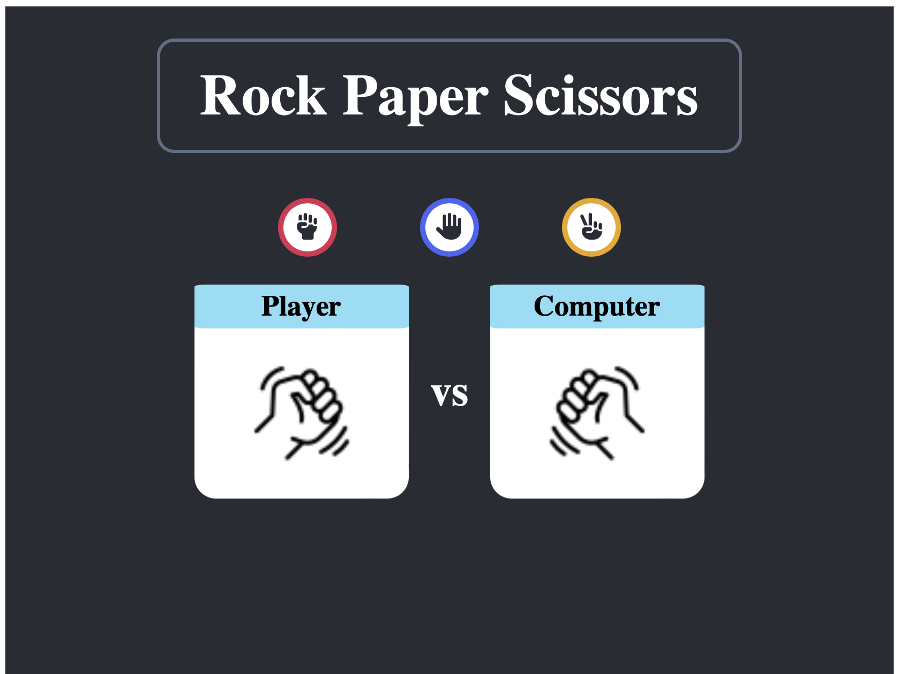

# Rock Paper Scissors Game

This project is a simple web application for playing the classic game of rock, paper, scissors. It allows users to select their action (rock, paper, or scissors) and compete against the computer.

## Features

* Choose your action: Select rock, paper, or scissors.
* Play against the computer: Compete against a random selection made by the computer.
* View results: See whether you won, lost, or tied the game.

<p align="center"></p>

## Technologies Used

* Python (Flask): Backend server for handling game logic and requests.
* JavaScript (React): Frontend framework for building the user interface.
* HTML/CSS: Markup and styling for the web application.

## Setup

* Clone the repository:

    ```bash
    git clone https://github.com/carolinajimenez/rock-paper-scissors-flask-react
    ```

* Navigate to the project directory:

    ```bash
    cd rock-paper-scissors-flask-react
    ```

* Install dependencies and run the application:

    - Install backend dependencies
        ```bash
        cd flask-server
        pip3 install -r requirements.txt
        python3 server.py
        ```

    - Install frontend dependencies
        ```bash
        cd client
        npm install
        npm start
        ```

* Open your web browser and navigate to http://localhost:3000 to view the application.

## Usage

Click on one of the buttons (rock, paper, or scissors) to select your action.
The computer will randomly select its action.

View the game result to see whether you won, lost, or tied the game.

<p align="center"></p>


# Contributing

Contributions are welcome! Feel free to open issues or submit pull requests for any bugs or feature requests.

# License

This project is licensed under the MIT License - see the LICENSE file for details.

